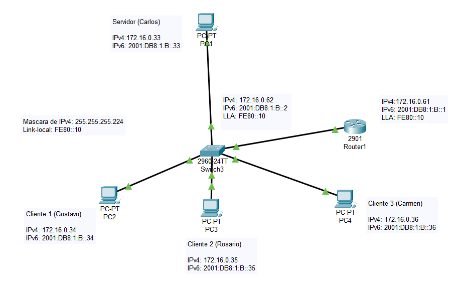
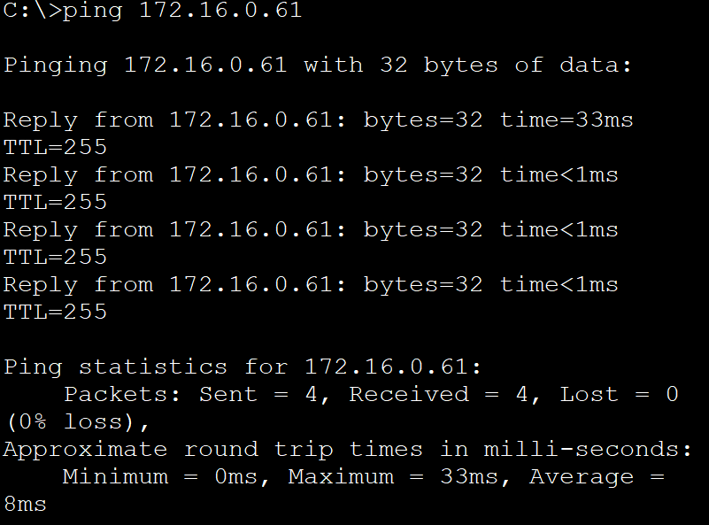
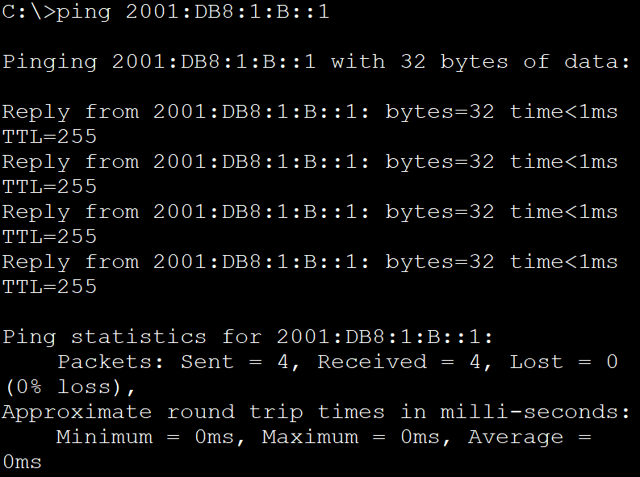

## Proyecto Integrador Motel París

# Integrantes
* Carmen Anahí Cornejo López 230110084
* Carlos Granados Montoya 230110073
* Gustavo Barrera Martínez 230110063
* Rosario Reyes Martínez 230110050

## Problematica 

Actualmente el Hotel París enfrenta ineficiencias operativas y deficiencias en el servicio al cliente debido a la falta de un sistema que permita gestionar de manera adecuada las reservaciones, el personal y los tickets.

## Propuesta del equipo

Nuestro equipo propone desarrollar un software que permita registrar de manera precisa las entradas y salidas de los huéspedes del Hotel París, optimizando así la administración de las reservas y el control de acceso.
El sistema se implementará utilizando C# para el desarrollo de las interfaces de usuario, garantizando una experiencia intuitiva y amigable. Para el almacenamiento de datos, se utilizará una base de datos en SQL, lo que permitirá una gestión robusta y segura de la información.

## ¿Cómo implementaremos nuestro proyecto?

La implementación contará con 8 sencillas fases, las cuales son los siguientes: 

1. **Análisis y diseño del sistema:** En esta fase nos encargaremos dentificar las necesidades del hotel relacionadas con la gestión de reservaciones, personal, tickets y servicios, de igual manera nos encargaremos de estructurar nuestra base de datos.

2. **Desarrollo del sistema:** Procedemos a desarrollar la interfaz de usuario, junto al modelo relacional de la base de datos. Tambien nos encargaremos de codificar las acciones que necesitamos para la reservaciones de clientes y registro de horas y salidas del Hotel. 

3. **Pruebas del software:** Después de haber concluido lo anterior pasaremos a probar en una red local nuestro sistema, verificando que se realicen de manera correcta, los procedimientos de nuestro software, aquí nos daremos cuenta de los errores que hemos cometido y podremos resolverlos para tener un resultado satisfatorio, es importante verificar que lo que estamos haciendo realmente cumple con los requerimientos que nos brindó el dueño del Hotel.

4. **Implementación:** Una vez teniendo concluido de manera correcta nuestro software, lo siguiente que debemos de hacer es instalar el software en el Hotel y brindar una pequeña capacitación a la persona encargada.

## Desarrollo
### División de la red 172.16.0.0/24 en subredes

Para dividir la red `172.16.0.0/24` en 5 segmentos, se aplica el proceso de **subneteo**, que consiste en dividir una red grande en subredes más pequeñas. La máscara `/24` proporciona 256 direcciones disponibles (de 0 a 255). Como se requieren al menos 5 subredes, se necesita una máscara que permita esa cantidad. Utilizando una máscara **`/27`**, cada subred contiene 32 direcciones (`2⁵ = 32`), de las cuales 30 son utilizables, ya que una se reserva como dirección de red y otra como broadcast. Con una máscara `/27` es posible crear **8 subredes**, lo cual es suficiente para cubrir las 5 necesarias.

Las subredes resultantes con máscara `/27` son las siguientes:

- **Primera subred:** `172.16.0.0 – 172.16.0.31`  
- **Segunda subred:** `172.16.0.32 – 172.16.0.63`  
- **Tercera subred:** `172.16.0.64 – 172.16.0.95`  
- _(y continúan en bloques de 32 direcciones)_

A nosostros nos corresponde la **segunda subred**, que comienza en la dirección **`172.16.0.32`** (dirección de red) y finaliza en **`172.16.0.63`** (dirección de broadcast). Las **direcciones IP utilizables** dentro de este segmento son desde **`172.16.0.33`** hasta **`172.16.0.62`**, lo que nos proporciona un total de **30 direcciones IP disponibles** para asignar a dispositivos dentro de esta subred.

- Dirección IPV6 global: 2001:DB8:1:b::64                                                                                                
- Dirección IPV6 Local:                                                                                                                 FE80::/10

## Topología de nuestra Red



## Configuración del Switch

### Configuraciones básicas
```plaintext
Switch> enable
Switch# config t
Switch(config)# enable password HotelParis
Switch(config)# hostname SWB
SWB(config)# banner motd ''
SWB(config)# line console 0
SWB(config-line)# password ci$co
SWB(config-line)# exit

Configuración de IPv4 e IPv6
SWB(config)# interface vlan 1
SWB(config-if)# ip address 172.16.0.62 255.255.255.224
SWB(config-if)# ipv6 address 2001:db8:1:b::2/64 
SWB(config-if)# ipv6 address FE80::10 link-local
SWB(config-if)# no shutdown
SWB(config-if)# description "toAdmin"
SWB(config-if)# exit

Configuración de contraseña Telnet
SWB(config)# line vty 0 15
SWB(config-line)# password 
SWB(config-line)# exit

Configuración SSH
SWB(config)# ip domain-name itsoeh.edu.mx
SWB(config)# username admin password admin
SWB(config)# crypto key generate rsa
How many bits in the modulus [512]: 1024
SWB(config)# line vty 0 15
SWB(config-line)# transport input ssh
SWB(config-line)# login local
SWB(config-line)# exit

Encriptar todas las contraseñas
SWB(config)# service password-encryption
```
## Configuración del Router

### Configuraciones básicas
```plaintext
Router> enable
Router# config t
Router(config)# enable password HotelParis
Router(config)# hostname RB
RB(config)# banner motd ""
RB(config)# line console 0
RB(config-line)# password ci$c0
RB(config-line)# exit

Configuración de IPv4 e IPv6
RB(config)# ipv6 unicast-routing
RB(config)# interface g0/1
RB(config-if)# ip address 172.16.0.61 255.255.255.224
RB(config-if)# ipv6 address 2001:db8:1:b::1/64
RB(config-if)# ipv6 address FE80::10 link-local
RB(config-if)# no shutdown
RB(config-if)# description 'toLanB'
RB(config-if)# exit

Configuración de contraseña Telnet
RB(config)# line vty 0 15
RB(config-line)# password Tics
RB(config-line)# exit

Configuración SSH
RB(config)# ip domain-name itsoeh.edu.mx
RB(config)# username admin password admin
RB(config)# crypto key generate rsa
How many bits in the modulus [512]: 1024
RB(config)# line vty 0 15
RB(config-line)# transport input ssh
RB(config-line)# login local
RB(config-line)# exit

Encriptar todas las contraseñas
RB(config)# service password-encryption
```

## Prueba de Conectividad (Ping)


